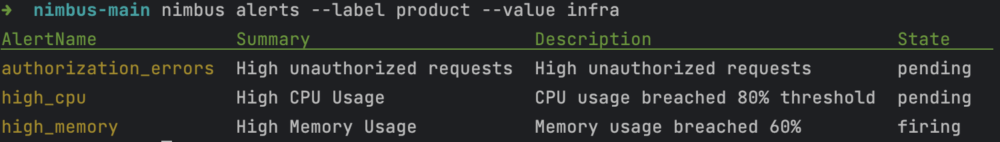

# nimbus

#### what is vmalert ?
vmalert executes a list of the given alerting or recording rules against configured `-datasource.url` compatible with Prometheus HTTP API. You can refer the doc https://docs.victoriametrics.com/vmalert.html to know more about vmalert.

#### what does nimbus do ?
It is a CLI based tool to provide insights into what are the different **alerts/rules** that are being fired or in inactive state. <br/> 
Currently foolowing insights are provided:

- Alerts can be filtered or queried by labels or name to get the list of alerts with following attributes(name, summary, description, state)
- Rules that are applied can e queried by labels or name to get list of rules. Rule name and the current state(inactive or firing) will be displayed.

vmalert UI displays a lot of information when more than one team is working on it. Not enough visibility on what alerts/rules are being used for a particular team.



## Install

###### Go version >= 1.18

```
go install github.com/rag594/nimbus@v0.0.3
```

## Usage
`VM_HOST` needs to be exported to point to vmalert host

```
export VM_HOST=<your VM alerts host>
```

### Alerts

```console
foo@bar:~$ nimbus alerts help
NAME:
   CLI for VM Alerts alerts - filter your alerts by name or labels

USAGE:
   CLI for VM Alerts alerts [command options] [arguments...]

OPTIONS:
   --name value  filter alerts by name

   Labels

   --label value  filter alerts by labels, provide key and then value. Example --label <key> --value <value>
   --value value  filter alerts by value, value should be provided with label. Example --label <key> --value <value>
```

### Groups

```console
foo@bar:~$ nimbus group help
NAME:
   CLI for VM Alerts group - lists down the rules

USAGE:
   use name flag to get info alertRules applied and get their state

OPTIONS:
   --name value  list rules name wise

   Labels

   --label value  filter rules by labels, provide key and then value. Example --label <key> --value <value>
   --value value  filter rules by value, value should be provided with label. Example --label <key> --value <value>
```
