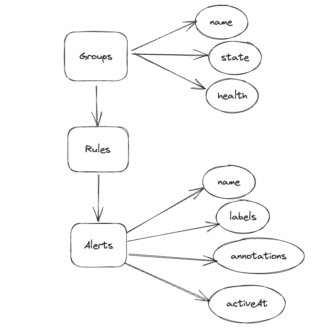

# nimbus
CLI based tool to query VMAlerts.VMAlerts Ui is currently cluttered and too slow.Want fast access to your rules/alerts then just nimbus it.



## Install

###### Go version >= 1.18

```
go install github.com/rag594/nimbus@v0.0.3
```

## Usage

```
export VM_HOST=<your VM alerts host>
```

### Alerts

```console
foo@bar:~$ nimbus alerts help
NAME:
   CLI for VM Alerts alerts - filter your alerts by name or labels

USAGE:
   CLI for VM Alerts alerts [command options] [arguments...]

OPTIONS:
   --name value  filter alerts by name

   Labels

   --label value  filter alerts by labels, provide key and then value. Example --label <key> --value <value>
   --value value  filter alerts by value, value should be provided with label. Example --label <key> --value <value>
```

### Groups

```console
foo@bar:~$ nimbus group help
NAME:
   CLI for VM Alerts group - lists down the rules

USAGE:
   use name flag to get info alertRules applied and get their state

OPTIONS:
   --name value  list rules name wise

   Labels

   --label value  filter rules by labels, provide key and then value. Example --label <key> --value <value>
   --value value  filter rules by value, value should be provided with label. Example --label <key> --value <value>
```
